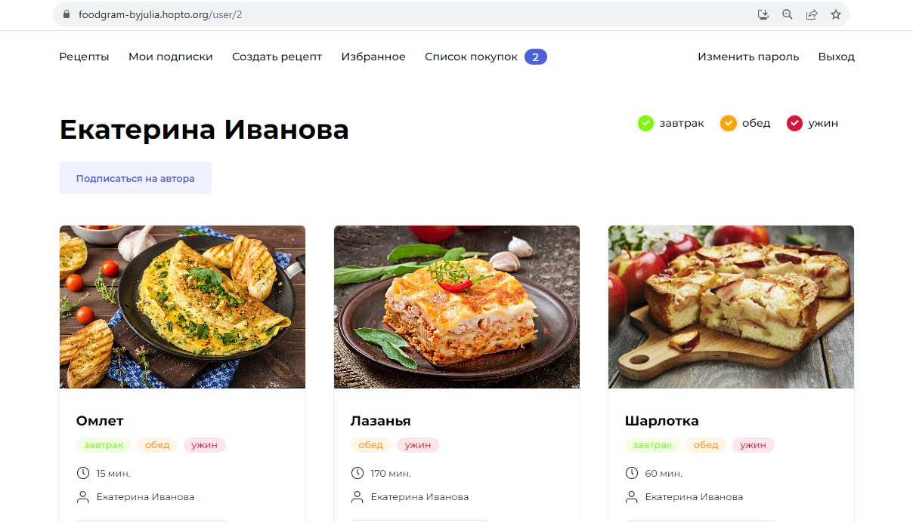

# Foodgram
### Описание проекта:

Проект **Foodgram** - это сайт, на котором пользователи могут публиковать свои рецепты,
а так же подписываться на других авторов и добавлять понравившиеся рецепты в избранное 
и список покупок (в этом разделе можно скачать файл с необходимыми ингредиентами для 
приготовления блюд).

### Стек технологий:

- Python 3.10.12
- node.js v18.17.1
- backend: Django
- frontend: React
- nginx
- gunicorn
- PostgreSQL
- Docker

### Запуск проекта:

<br>1. Клонировать репозиторий:

```
git clone "адрес клонируемого репозитория"
```
<br>2. В корневой директории проекта создать файл .env и написать следующие переменные:

```
# Пременные для СУБД PostgreSQL:
POSTGRES_USER # Имя пользователя
POSTGRES_PASSWORD # Пароль пользователя
POSTGRES_DB # Имя базы даных

# Переменные для Django-проекта:
DB_HOST # Адрес, по которому Django будет соединяться с базой данных(При работе нескольких 
          контейнеров в сети Django network, вместо адреса указывают имя контейнера, где 
          запущен сервер БД)
DB_PORT # Порт, по которому Django будет обращаться к БД. Для PostgreSQL порт по умолчанию 
          5432
```

<br>3. Там же создать и активировать виртуальное окружение:

```
python3 -m venv env
```

* Если у вас Linux/macOS

    ```
    source env/bin/activate
    ```

* Если у вас windows

    ```
    source env/scripts/activate
    ```

<br>4. Далее перейти в папку **infra** которая находится в корневой директории и 
запустить файл **docker-compose.yml**:

```
docker compose -f docker-compose.yml up
```
<br>5. После этого выполнить следующие команды:

* Собрать статику:

    ```
    docker compose -f docker-compose.yml exec backend python manage.py collectstatic
    docker compose -f docker-compose.yml exec backend cp -r /app/collected_static/. \
    /backend_static/static/
    ```

* Выполнить миграции:

    ```
    docker compose -f docker-compose.yml exec backend python manage.py migrate
    ```

* Загрузить необходимые данные(для загрузки списков тегов и ингредиентов, указанные 
  в файлах, которые находятся в папке **backend/data**):

    ```
    docker compose -f docker-compose.yml exec backend python manage.py loadingredientstags
    ```


### Автор проекта:

Семёнова Юлия (GitHub: JuliSem)

### Project's preview:

* **Главная страница**
  
    

* **Страница пользователя**
 
    

* **Страница рецепта**
  
    

* **Подписки**

    

* **Избранное**

    

* **Список покупок**

    

Список эндопонтов других страниц можно посмотреть в **ReDoc** (необходимо перейти по ссылке 
```http:/localhost/api/docs/``` при локальном запуске проекта в контейнерах)
